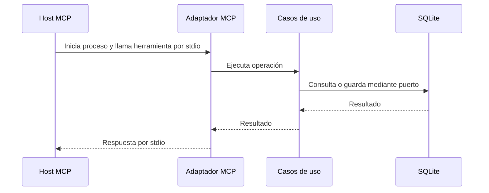

# ADR 003: Exponer MCP local por stdio

## Estado

Aceptado.

## Contexto

Un agente compatible con Model Context Protocol (MCP) debe consultar la
disponibilidad y administrar citas. Debe reutilizar los casos de uso y la
política de agenda sin acceder directamente a SQLite ni duplicar reglas.

## Decisión

Expondremos un adaptador de entrada MCP por `stdio` con el SDK oficial. El host
lo iniciará como proceso local por sesión. El adaptador usará el mismo contenedor
de aplicación que FastAPI y declarará como solo lectura las consultas; instruirá
al agente para confirmar con el usuario las operaciones que modifican datos. El servicio
Compose será opcional y no publicará puertos.

## Consecuencias

- HTTP y MCP compartirán reglas de negocio y persistencia; mantendremos un
  adaptador de entrada adicional.
- Cada host MCP necesitará su propia configuración de arranque y aprobación.
- Las notificaciones del proceso MCP escribirán en `stderr` para preservar el
  canal `stdio`.
- El transporte servirá para uso local. Una exposición por red requerirá otro
  transporte, autenticación y autorización para los datos de pacientes.
